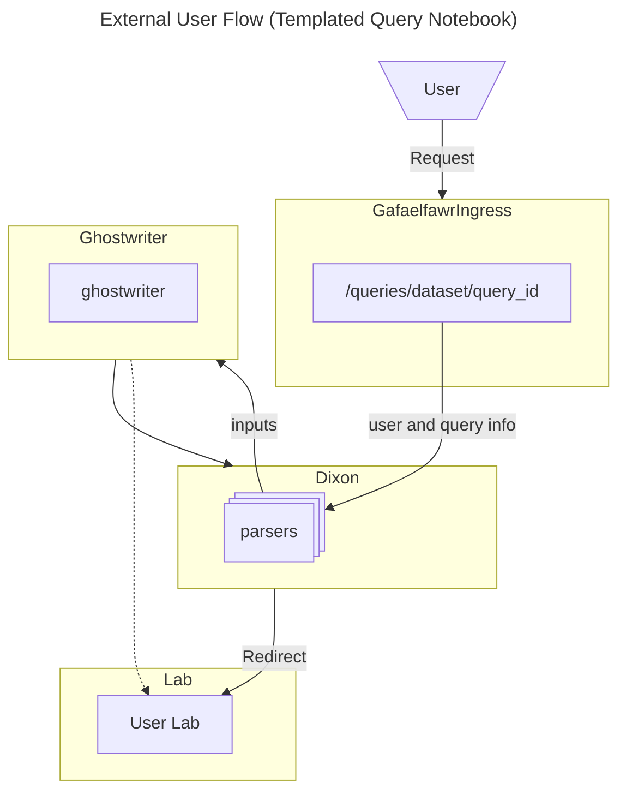
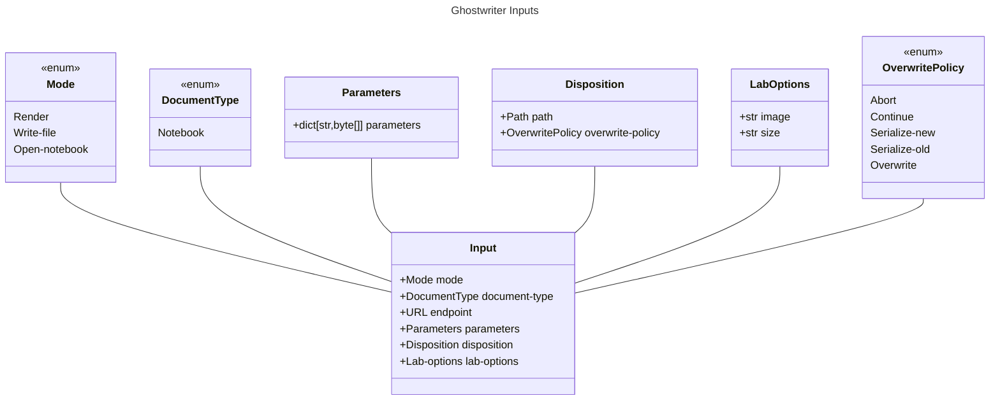
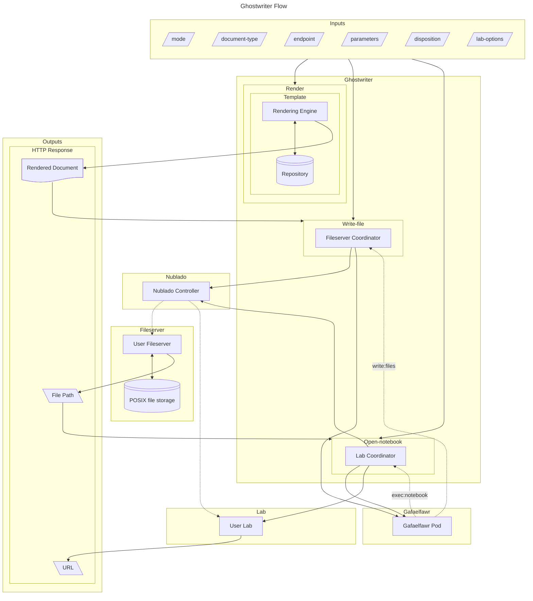
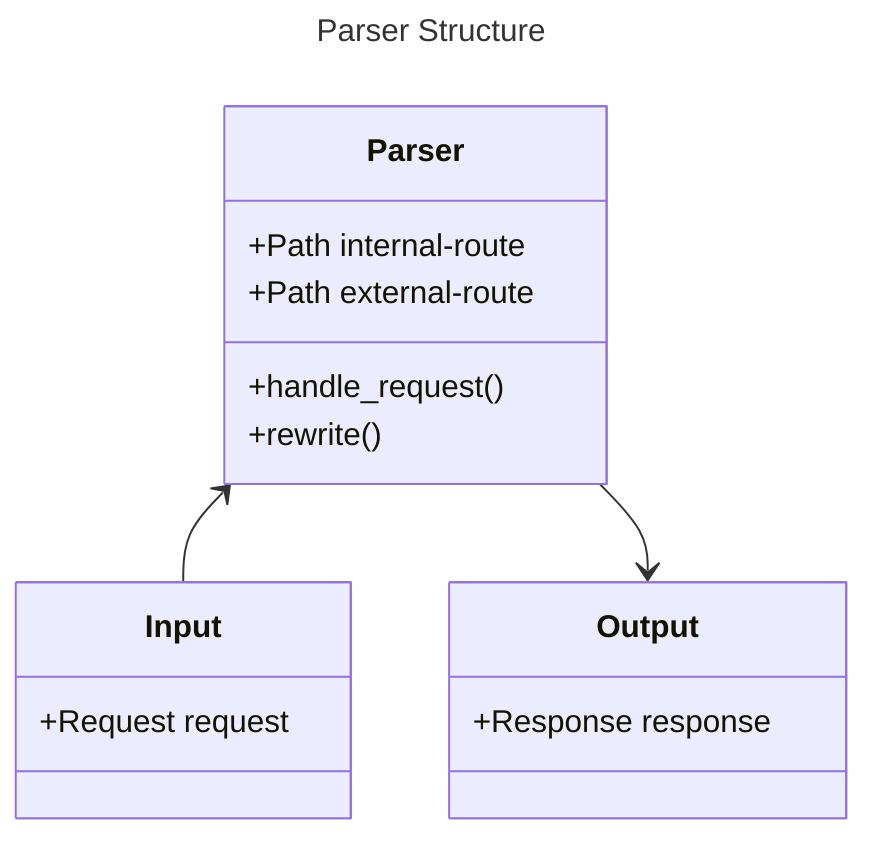
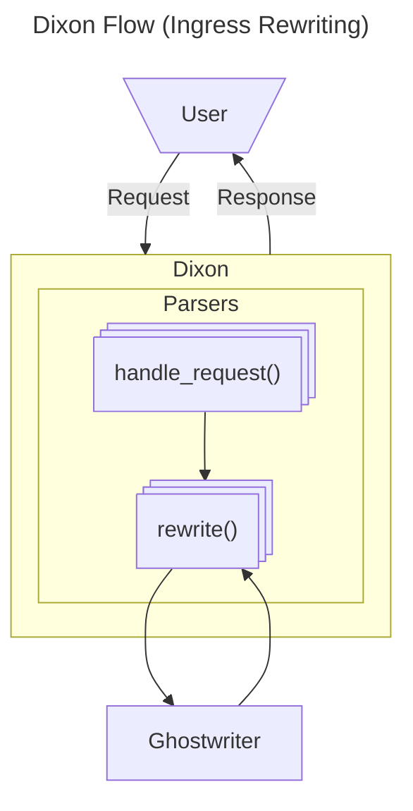

# Ghostwriter

```{abstract}
Ghostwriter is a service that produces rendered documents on behalf of a user.
```

## Overview

The purpose of Ghostwriter is to produce documents, possibly rendered from a template and a set of parameters, on behalf of a user of an RSP instance.

One use case for this is to provide static links to tutorial notebooks, such that when a user clicks on them in documentation, they are presented with that notebook running in a Lab environment.
A second one is to provide a route which can have a TAP query ID stuck on the end, such that when a user goes there, they are presented with a notebook set up to perform that TAP query and retrieve its results.
Other use cases are expected to present themselves as we further develop Ghostwriter.

Ghostwriter is composed of two services.
`Ghostwriter` itself is the back-end service that renders documents, writes files, and/or rewrites URLs.
`Dixon` is the front-end service that consumes HTTP requests, extracts parameters from them which will be used to construct `Ghostwriter` inputs, and ultimately returns a result to the end user, which may be a rendered document, an HTML document containing a link, or an HTTP Redirect for the user's browser.
A `Dixon` endpoint will always be associated with a `GafaelfawrIngress` and provides the primary way end-users will interact with `Ghostwriter`.

## User interaction diagram

This is a high-level diagram showing a typical conceptual flow.

In this case a user goes to a query url `/queries/<dataset>/<query_id>`, so, for example, something like `/queries/dp1/a432980e`.

Note in particular that there may be multiple passes through Dixon parsers, each triggering an action in Ghostwriter.

Eventually, all parsers applicable to the request will have been processed, and the final output will be used to redirect the user's browser to a Lab open to a notebook where the requested query ID has been subsituted into the notebook template.



## Ghostwriter

Ghostwriter renders documents from templates combined with request-specific information, which may include user details, query IDs, repository names, or anything that might be a template parameter necessary to produce a complete document.

It also coordinates the systems that ultimately present those documents.
Initially the two systems thus represented are the fileserver service and the JupyterLab notebook service.

### Inputs

Ghostwriter has six inputs for a given action.

#### Mode

The mode of operation must be specified as an input.
There are at least three modes.

1. Request a document and return that document directly to the caller.
   This document may have parameters subsituted into a template via user input.
   This mode is called `render`.
2. Perform step 1, and then write that document into POSIX file space accessible to the user.
   This mode is called `write-file`.
3. Perform steps 1 and 2, and then open a JupyterLab instance open to the document within the user's file space.
   This mode is called `open-notebook`.

Additionally there may, in future, be other modes, which are not yet defined.


#### Document type

Document rendering may differ by document type.
Initially, Ghostwriter will only support one type, `Notebook`.
In future it may support other types.
The `Notebook` type is an IPython notebook, distinguished by the file suffix `.ipynb`; it is a JSON document with the structure of a [Jupyter Notebook](https://ipython.org/ipython-doc/3/notebook/nbformat.html).

#### Endpoint

The endpoint from which to fetch the input document must be specified as a Ghostwriter input.
For the `Notebook` document type, templating may be delegated to [Times Square](https://sqr-062.lsst.io/).

#### Parameters

A document may require substitution parameters.
These are supplied to Ghostwriter as a string-to-byte-array mapping; strings will be encoded in the values of this mapping as UTF-8.

#### Disposition

If the mode is `write-file` or `open-notebook`, disposition must be specified.
Disposition is a tuple containing the destination of the file within the user's available POSIX file space and the policy specifying what to do if the file already exists.
If the mode is `render`, disposition should be null, and will in any case be ignored.

#### Lab options

If the mode is `open-notebook`, Lab options may be specified.
These will be the usual Lab parameters, specifying size and image.
They will be ignored if a user Lab is already running, and if they are omitted, reasonable defaults will be chosen.

### Mode `render`

The first mode of operation takes an endpoint and a set of substitution parameters (possibly empty) as input, and returns a rendered document.

#### Outputs

The `render` mode creates a byte sequence that is the rendered document.
The document type will then guide what validation, if any, to perform on
the byte sequence.
For instance, the `Notebook` type will first be decoded into a string with the assumption that the bytes are UTF-8 encoded.
That string should be able to be loaded as a JSON document, and that JSON document itself should have the structure of a [Jupyter Notebook](https://ipython.org/ipython-doc/3/notebook/nbformat.html).

Note that this design makes no provision for streaming documents.
Ghostwriter, in `render` mode, returns the entire rendered document to Dixon, which then returns the document to the user browser.
We therefore implicitly assume that rendered documents in this mode will be smallish (megabytes rather than gigabytes or larger).
If this assumption is incorrect, we can revisit the design; however, it seems very likely that large documents will be written to storage (whether as rendered notebooks or as saved files) rather than simply returned in-memory.
Therefore one of the two other modes will generally be more useful in the large-document case.

### Mode `write-file`

In the second mode of operation, Ghostwriter will take the document contents retrieved in the first step and write those to a user's file space.

#### Write-file Inputs

In addition to the inputs required for rendering a document, the disposition for the file myst be specified.

The disposition will contain a file relative to the top of the user filestore, and a policy specifying what to do if that file already exists.

That policy consists of the following five options:

1. Abort: this terminates the Ghostwriter operation with a failure code.
2. Continue: this acts as if the file had been rendered and written successfully, but the original file contents are used instead.
3. Serialize-new: this will find an unused serial number appended to the filename (e.g. `Document-1`, `Document-2`, ...) and write the file at that serialized filename.
4. Serialize-old: this will find an unused serial number, move the file currently at the destination filename to that serialized filename, and then write the document to the original filename.
5. Overwrite: this will unconditionally overwrite the extant file with the new document.

#### Write-file Outputs

Because of the `Serialize-new` policy, we cannot assume that the requested filename and the actual destination filename are identical.
Therefore this stage must return the actual rendered filename to the caller.
This will be a file path relative to the top of the document store containing the user's files.

Note that there is no need to return the document itself to the caller: the rendered document has been persisted to file storage, and can be retrieved from there by the user.

#### Operation

In order to write a file on behalf of a user, Ghostwriter will first need to acquire a token with the `write:files` scope.
This can be accomplished with a call to [Gafaelfawr](https://gafaelfawr.lsst.io/).
The token thus acquired should be short-lived.

Ghostwriter will then start a fileserver for its calling user, or use the extant fileserver if one is already running.

Once the fileserver is running, Ghostwriter will then upload the file to the appropriate destination (in case of conflict, using the overwrite option specified in its inputs) via the WebDAV protocol.

It can then respond to Dixon, which will construct an appropriate HTTP
Response for the user's browser.

### Mode `open-notebook`

First, the `open-notebook` mode does everything `write-files` does.

The document, which is a Jupyter notebook, now exists within the user's file space.
Next, Ghostwriter must ensure that a Lab for the user is running.
It will then respond to Dixon, which will in turn issue an HTTP Redirect to the user's browser in order to display the document within the running Lab.

#### Open-notebook Inputs

In addition to the inputs for rendering a document and writing it to storage, since Ghostwriter may start a user Lab, the usual set of parameters (e.g. image and size) for starting a Lab must be supplied (or defaulted).

The file path must also be supplied, and as explained above, this may or may not be the path originally specified in the disposition input.

#### Ensuring a running lab

Ghostwriter will then acquire a Nublado Client and test whether the user has a running JupyterLab instance.
If the user does not, Ghostwriter will request that the user's lab be started.

One could argue that Ghostwriter should also test the running lab to see whether it is at least as large as the Lab Ghostwriter would start and that it is running the correct image.
However, since in general a running Lab indicates that a user is interactively using the lab, and since we do not have any provision for multiple active Labs at the same time, the necessity to terminate and respawn the user lab makes this seem like a terrible idea.
We will begin, at least, with the assumption that if a lab is already running, we use that same lab to open the rendered document.

At the end of this step, a JupyterLab instance will be running as the requesting user.

#### Open-notebook Outputs

Ghostwriter must then translate the file space filename and path from the destination it knows from the `write-files` step into a path relative to the file browser root within the JupyterLab instance.
This is going to be trickier than it looks, in that the browser root is a setting inside Nublado (presumably it will be configured by Phalanx) and thus not necessarily directly accessible to Ghostwriter.
Although at the time of writing the root can be assumed to be the user's home directory, if we ever want to do collaborative editing, it will have to be the root of the filesystem inside the Lab instead (or at least the last common ancestor of filesystems we wish to expose for collaborative editing, which is currently the root directory).

This could be persisted as a Phalanx global setting (it inherently spans the Nublado application and Ghostwriter), but that doesn't feel right.
Suggestions are welcomed.

At any rate, once that is determined, the path-in-storage can be translated to a path underneath a `/tree` URL in the running lab.

Because file names are small, it is likely useful to return the file path as well as the Lab URL from the `open-notebook` stage, although the file path can be recovered from the URL with fairly trivial computation, modulo the above discussion of JupyterLab file browser root.

In `open-notebook` mode there is again no need to return the rendered document contents to the caller.

#### Opening the document

This URL will be returned to the `Dixon` service, which will then issue an HTTP Redirect constructed from it.

### Input classes

The input to Ghostwriter will be an instance of a class structured like this:



As above, the `Path` type is [`pathlib.Path`](https://docs.python.org/3/library/pathlib.html#pathlib.Path) from the Python standard library.

If `mode` is `render`, `disposition`, `overwrite-policy`, and `lab-options` may be `None` (`null` in the input JSON).
If `mode` is `write-files`, `lab-options` may be `None` (`null` in the input JSON).

### Ghostwriter Flow

This graph shows the flow of a Ghostwriter call.
Note that the rendered document becomes an input to the `write-files` stage, and likewise the written file path becomes an input to the `open-notebook` stage.



### HTTP interaction

Interaction with the ghostwriter API will be an HTTP POST with content-type `application/json`, where the POST body is a JSON document containing UTF-8-encoded representations of each field: parameter keys and values, the appropriate enum values (which will be strings) for each of the enum fields, and the endpoint URL and disposition file path (if any).
Fields that are not meaningful for a given mode may be (and should be) `null`.
This POST will generally not be issued directly by the user, but will result as a consequence of some user query against a route mapped to a Dixon parser.

If the query succeeds, an HTTP response will be received.

#### Render Mode

If a document is being returned, the content-type should be `application/json` for a `Notebook` type query, and success should be indicated by a `200` HTTP status code.

#### Write-files Mode

If the mode is `write-files`,  a successful request will return a `200` status response, with content-type `application/json` and a `url` field indicating a path via a user fileserver to the document.
It is Dixon's responsibility to translate the file path received from Ghostwriter into a URL accessible via the user fileserver.
It is not clear that this should be returned by Dixon as an HTTP `302` temporary redirect; it may be better to return an HTML document with this value included as a link, because it is unlikely (although it is certainly possible) that the user's browser is also their WebDAV client.

#### Open-notebook Mode

If the mode is `open-notebook`, a successful request will return a `200` status response, with content-type `application/json` and a `url` field indicating the running user Lab open to the correct document.
The value of this field can be used directly as the `Location` for an HTTP `302` temporary redirect.
It is the Dixon service's job to transform the output into an HTTP Redirect for the user browser.

#### Failure

If the query fails, the HTTP error code should reflect the nature of the error: 401 or 403 for authentication/authorization errors (including the case when a file is generated, but the destination file already exists and the overwrite policy is `abort`), 404 if the input document for templating cannot be found, and 500 if templating fails or one of the necessary servers (the fileserver or the Lab) cannot be started, for instance.
Addidtionally, the HTTP error text should attempt to give more details about the nature of the problem.

#### Usage

Note that this does not imply that interaction with registered routes must be via a POST.
Indeed, these will usually be GETs with path parameters and user information in the request headers; however, this GET (or other request) will be handled by a Dixon parser, which will trigger a POST to the service API, or possibly its moral equivalent (see the Kubernetes discussion below; Dixon-Ghostwriter communication may not actually take place over HTTP).

### Implementation

Ghostwriter is a standard SQuaRE FastAPI application.

## Dixon

Dixon is the service that translates a user HTTP request into a set of Ghostwriter input parameters, invokes Ghostwriter with those parameters, and then returns a redirect to the user to point the user to the Ghostwriter-rendered document.

### Pluggable parsers

The first version of Ghostwriter incorporated Dixon functionality by registering routes underneath `/ghostwriter/rewrite`, and mapping those routes to specific sets of actions via a set of `hooks`.
After that, top-level routes (e.g. `/tutorials` or `/queries`) were given Gafaelfawr Ingresses to redirect those routes to Ghostwriter rewrite routes, which in turn triggered Ghostwriter hooks to substitute parameters as necessary and ultimately return a redirect to a Lab with a templated query or a tutorial opened in a notebook.

With the separation of Ghostwriter and Dixon, we can make this a somewhat cleaner division of responsibilities.

#### Operation

The parser classes (tentatively: `DixonParser`) will be chainable, to allow for composable and reusable actions; this implies that the set of parsers for a given route be made up of an ordered list of transformation classes.

A Dixon route will always be paired with a `GafaelfawrIngress`, and that route will be associated with a pluggable transformer class (these are functions known as `hooks` in the current implementation, and are instances of `DixonParser` in this proposed implementation).

These class instances must accept an HTTP Request, which may contain path or query parameters, cookies, headers, and/or bodies, any or all of which may specify relevant information, and, in their `handle_request()` route, marshal that input into route data and the necessary information for a Ghostwriter input.

The class will then call its `rewrite()` method.
This is the business logic for turning the HTTP Request into an HTTP Response.
Any of these parser classes may make HTTP calls to one or more services (typically, [Repertoire](https://repertoire.lsst.io)) in order to resolve its request data to a Ghostwriter input.

It will be within the `rewrite()` method that Dixon will invoke Ghostwriter to perform required actions, which will include rendering a document, and may include writing a file to storage or starting a user Lab.

Ghostwriter will return output to Dixon that may include the rendered document, the file path written (if any) and a URL for the running notebook (if any).

If more classes remain in the chain of parsers, the Ghostwriter output will be combined with the earlier route and input data (exactly how being determined by the parser's business logic), and submitted to Ghostwriter again.
This process will repeat until all parsers in the chain have completed.

Dixon will then return an HTTP response to the user's browser; this may be the rendered document, an HTML document containing a link to access the written file via WebDAV, or an HTTP redirect pointing the browser to the running Lab.

#### URL and Path Rewriting

All knowledge of how to transform file paths and URLs is held within Dixon rather than Ghostwriter.
A given parser's `handle_request()` method converts the incoming HTTP Request into a set of parameters (derived from path components, headers, cookies, query strings, and the request body).

Those parameters are then sent on to that parser's `rewrite()` method.
That business logic guides a call to Ghostwriter.
Ghostwriter's response will either be used to construct parameters for the next parser's `rewrite()` method, or if the end of the parser chain has been reached, turned into an HTTP Response to be returned to the caller.

This provides a clean separation of concerns: Ghostwriter handles the document rendering process and the back-end mechanisms of writing files and manipulating user Labs, while Dixon provides the presentation layer that directs the user's browser to consume the rendered documents.

#### Plugin architecture

In the current architecture, all rewrite functionality is held in `hooks`, which are simply functions defined within the Ghostwriter source code.
This effectively restricts creation of new route rewriting functionality to the core SQuaRE development team.

The new architecture is intended to be more flexible in principle.
Whether anyone takes advantage of this flexibility will be an open question.

Although we will supply implementations for our initial set of parser classes needed to implement templated queries and tutorial access, any Python class that meets the restrictions of the parser interface (correctly-typed implementations of `handle_request()` and `rewrite()`) can be used as a parser class.

Note that in order to deploy a new parser, the developer will have to work closely with a Phalanx administrator, because each use of `handle_request()` will be coupled to a particular GafaelfwarIngress defined in a Phalanx application template, and therefore a developer of parser functionality will have to also write Helm deployment YAML and configure the list of parser classes for each route in order to have the parser take effect.

The parser class or classes for that route may come from any package.
That means that the Ghostwriter sets of lists of classes bound to routes must be specifiable via configuration, although if third parties are developing parsers, they will need to run Ghostwriter at their site from a container image that makes those parser classes available.

#### Parser structure

The parser class will be constructed with an internal route and an external route.
The internal route represents where this parser is mounted relative to Dixon's root endpoint.
The external route represents the route within the RSP instance that triggers this parser chain to operate.

It also exposes two methods, `handle_request()` and `rewrite()`.

### Class Diagram



### Typing

The `Path` type is [`pathlib.Path`](https://docs.python.org/3/library/pathlib.html#pathlib.Path) from the Python standard library.
The `Request` type is [`httpx.Request`](https://www.python-httpx.org/api/#request).
The `Response` type is [`httpx.Response`](https://www.python-httpx.org/api/#response).

The `handle_request()` method takes a `Request` and returns a `Response`.

The typing for `rewrite()` is not yet fully determined, but should include a `Request`, a `dict[str,byte[]]` for parameters (again, values will be UTF-8 encoded), and a `next_parser` optional parameter, which is itself an instance of the parser class.
At the end of its `rewrite()` call, if `next_parser` is not `None`, it should call `next_parser.rewrite()` with inputs it determines.
If there is no `next_parser` it should return a `Response` which will then potentially be modified by the calling `handle_request()` and returned to `handle_request()`'s caller.

#### Dixon Flow



### Implementation

Dixon will differ from our usual FastAPI application pattern.
Although the core event loop will still be a FastAPI application, and although it will use Pydantic to model its objects, it must differ in some fairly radical ways.

The first of these is that its event loop will depend on a registry of parser classes, and that it will fundamentally be an iterative transformation engine that makes calls and receives responses from Ghostwriter.
Few if any of our other applications use a plugin model like Dixon will require.

The second is that it is fundamentally not a service that receives a JSON payload, transforms that into a Python object, and does something with that object.
Rather, it receives an HTTP Request, performs operations on that request that extract parameters from it, combines those parameters with parser business logic, and submits a request to Ghostwriter.
The Ghostwriter response triggers either another request to Ghostwriter, or the return of an HTTP Response to the caller.


## JupyterLab integration

Once this version of Ghostwriter is running successfully, a large portion of the backends of the Query extension and the Tutorials extension within [rsp-jupyter-extensions](https://github.com/lsst-sqre/rsp-jupyter-extensions) can be replaced with calls to Dixon (or perhaps directly to Ghostwriter, depending on need).
The menu generation is on the frontend, and in each case must remain (and reporting the tutorial structure and recent query IDs will need to remain backend functionality).
However, extension backend functionality implementing templating queries or writing local copies of the tutorials, and then generating URLs for redirection, can be delegated to Ghostwriter.

The Ghostwriter extension itself will need to remain.
In order to ensure a running lab and then redirect the user to a specific path within that lab, the Ghostwriter extension must be the target page; what it returns will guide the user's browser to the correct destination.
This is the technique called the "bank shot" in the current implementation.
It can also be used, once we have a user preference mechanism, to determine whether to redirect the user browser to the tutorial landing page or the default Lab UI.

## Kubernetes Implementation

Because Dixon and Ghostwriter are so tightly coupled, they probably should be implemented as Containers within a single Pod.
This will ensure they run on the same node and thus avoid use of the actual network.
In that case it might make sense to have Dixon and Ghostwriter communicate with each other over named pipes rather than TCP sockets.

It might even prove advantageous to implement them as a pair of modules within the same FastAPI implementation.
This is the way that the current implementation works.
In that case their communication could simply be in-memory, as communication between Python classes, rather than over even a simulated network.

However, even though our current use cases seem to indicate that Ghostwriter is always called by Dixon, we will want to expose Ghostwriter over an HTTP endpoint.
We expect it to eventually acquire new modes of operation, and a generic document-rendering service is useful in its own right.
Again, this is fundamentally how the current implementation works: Ghostwriter functionality is currently hosted at `/ghostwriter` while the Dixon features are found at `/ghostwriter/rewrite`.
