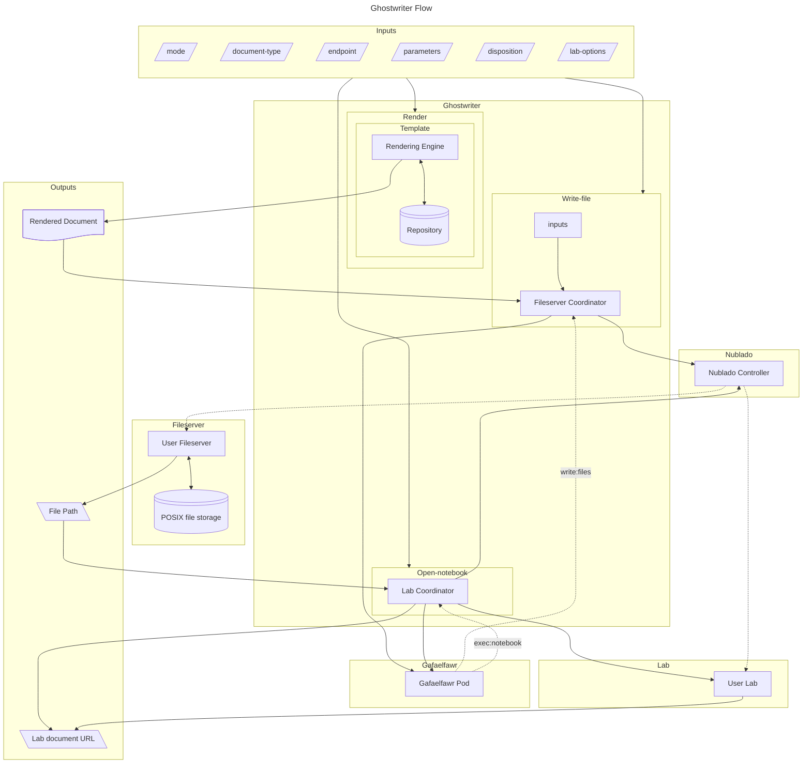
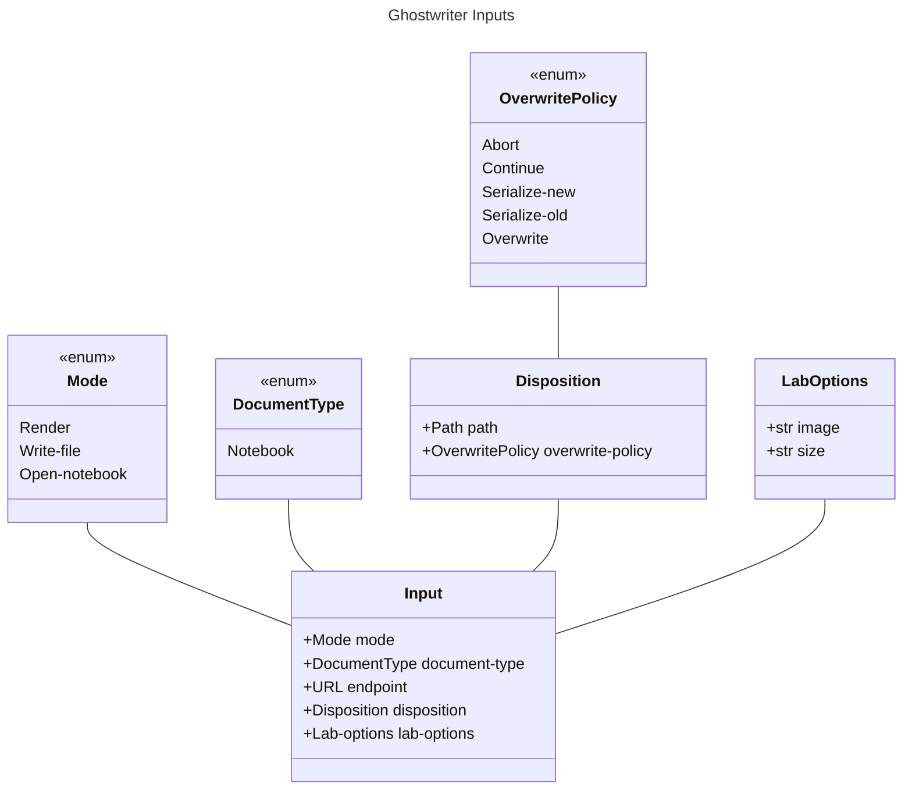
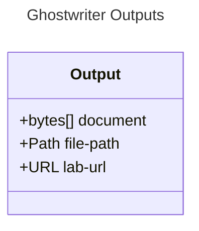
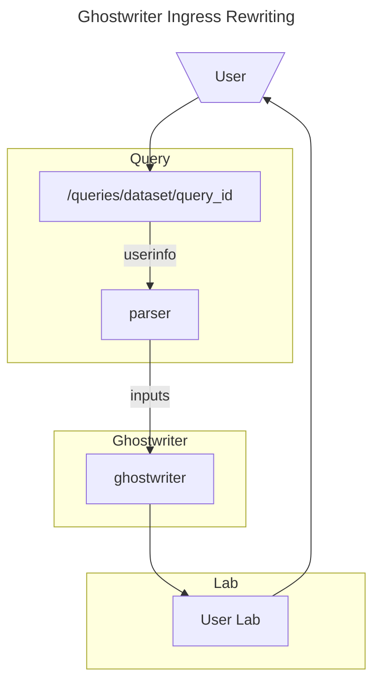

# Ghostwriter

```{abstract}
Ghostwriter is a service that produces rendered documents on behalf of a user.
```

## Overview

The purpose of Ghostwriter is to produce documents, possibly rendered from a template and a set of parameters, on behalf of a user of an RSP instance.

One use case for this is to provide static links to tutorial notebooks, such that when a user clicks on them in documentation, they are presented with that notebook running in a Lab environment.
A second one is to provide a route which can have a TAP query ID stuck on the end, such that when a user goes there, they are presented with a notebook set up to perform that TAP query and retrieve its results.
Other use cases are expected to present themselves as we further develop Ghostwriter.

## Flow diagram



### Inputs

#### Mode

The mode of operation must be specified as an input.
There are at least three modes.

1. Request a document and return that document directly to the caller.
   This document may have parameters subsituted into a template via user input.
   This mode is called `render`.
2. Perform step 1, and then write that document into POSIX file space accessible to the user.
   This mode is called `write-file`.
3. Perform steps 1 and 2, and then open a JupyterLab instance open to the document within the user's file space.
   This mode is called `open-notebook`.

Additionally there may, in future, be other modes, which are not yet defined.


#### Document types

Document rendering may differ by document type.
Initially, Ghostwriter will only support one type, `Notebook`.
In future it may support other types.
The `Notebook` type is an IPython notebook, distinguished by the file suffix `.ipynb`; it is a JSON document.

#### Endpoint

The endpoint from which to fetch the input document must be specified as a Ghostwriter input.
For the `notebook` document type, templating may be delegated to [Times Square](https://sqr-062.lsst.io/).

#### Parameters

A document may require substitution parameters.
These are supplied to Ghostwriter as a string-to-bytes mapping; strings will be encoded as UTF-8.

#### Disposition

If the mode is `write-file` or `open-notebook`, disposition must be specified.
Disposition is a tuple containing the destination of the file within the user's available POSIX file space and the policy specifying what to do if the file already exists.
If the mode is `render`, disposition should be null, and will in any case be ignored.

#### Lab options

If the mode is `open-notebook`, Lab options may be specified.
These will be the usual Lab parameters, specifying size and image.
They will be ignored if a user Lab is already running, and if they are omitted, reasonable defaults will be chosen.

### Mode `render`

The first mode of operation takes an endpoint and a set of substitution parameters (possibly empty) as input, and returns a rendered document.

#### Outputs

The `render` mode creates a byte sequence that is the rendered document.
The document type will then guide what validation, if any, to perform on
the byte sequence.
For instance, the `notebook` type will first be decoded into a string with the assumption that the bytes are UTF-8 encoded.
That string should be able to be loaded as a JSON document, and that JSON document itself should have the structure of a [Jupyter Notebook](https://ipython.org/ipython-doc/3/notebook/nbformat.html).

### Mode `write-file`

In the second mode of operation, Ghostwriter will take the document contents retrieved in the first step and write those to a user's file space.

#### Inputs

In addition to the inputs required for rendering a document, the disposition for the file myst be specified.

The disposition will contain a file relative to the top of the user filestore, and a policy specifying what to do if that file already exists.

That policy consists of the following five options:

1. Abort: this terminates the Ghostwriter operation with a failure code.
2. Continue: this acts as if the file had been rendered and written successfully, but the original file contents are used instead.
3. Serialize-new: this will find an unused serial number appended to the filename (e.g. `Document-1`, `Document-2`, ...) and write the file at that serialized filename.
4. Serialize-old: this will find an unused serial number, move the file currently at the destination filename to that serialized filename, and then write the document to the original filename.
5. Overwrite: this will unconditionally overwrite the extant file with the new document.

#### Outputs

Because of the `Serialize-new` policy, we cannot assume that the requested filename and the actual destination filename are identical.  Therefore this stage must return the actual rendered filename to the caller.
This will be a file path relative to the top of the document store containing the user's files.

#### Operation

In order to write a file on behalf of a user, Ghostwriter will first need to acquire a token with the `write:files` scope.
This can be accomplished with a call to [Gafaelfawr](https://gafaelfawr.lsst.io/).
The token thus acquired should be short-lived.

Ghostwriter will then start a fileserver for its calling user, or use the extant fileserver if one is already running.

Once the fileserver is running, Ghostwriter will then upload the file to the appropriate destination (in case of conflict, using the using the overwrite option specified in its inputs) via the WebDAV protocol.

### Opening the document in JupyterLab

The document now exists within the user's file space.
Next Ghostwriter must ensure that a Lab for the user is running, and then display the document within the Lab.

#### Inputs

In addition to the inputs for rendering a document and writing it to storage, since Ghostwriter may start a user Lab, the usual set of parameters (e.g. image and size) for starting a Lab must be supplied (or defaulted).

The file path must also be supplied, and as explained above, this may or may not be the path originally specified in the disposition input.

#### Ensuring a running lab

Ghostwriter will then acquire a Nublado Client and test whether the user has a running JupyterLab instance.
If the user does not, Ghostwriter will request that the user's lab be started.
One could argue that Ghostwriter should also test the running lab to see whether it is at least as large as the Lab Ghostwriter would start and that it is running the correct image.
However, since in general a running Lab indicates that a user is interactively using the lab, and since we do not have any provision for multiple active Labs at the same time, the necessity to terminate and respawn the user lab makes this seem like a terrible idea.
We will begin, at least, with the assumption that if a lab is already running, we use that lab to open the rendered document.

At the end of this step, a JupyterLab instance will be running as the requesting user.

#### Outputs

Ghostwriter must then translate the file space filename and path from the destination it knows from step 2 into a path relative to the browser root.
This is going to be trickier than it looks, in that that is a setting inside Nublado (presumably it will be configured by Phalanx) and thus not necessarily directly accessible to Ghostwriter.
Although at the time of writing the root can be assumed to be the user's home directory, if we ever want to do collaborative editing, it will have to be the root of the filesystem inside the Lab instead.
This could be persisted as a Phalanx global, but that doesn't feel right.
Suggestions welcome.

At any rate, once that is determined, the path-in-storage can be translated to a path underneath a `/tree` URL in the running lab.

#### Opening the document

That URL will be returned to the caller and can be used to redirect the user to the Lab opened to the correct document.

## Implementation

Ghostwriter is almost a standard SQuaRE FastAPI application.
However, it will necessarily differ in that, in addition to the routes that are directly serviced by Ghostwriter, there will be some number of ingresses that trigger Ghostwriter actions, and which then return browser redirects to the caller.

### Plugabble parsers

The first version of ghostwriter handled this by registering routes underneath `/ghostwriter/rewrite`, and mapping those routes to specific sets of actions via a set of `hooks`.
After that, top-level routes (e.g. `/tutorials` or `/queries`) were given Gafaelfawr Ingresses to redirect those routes to Ghostwriter rewrite routes, which in turn triggered Ghostwriter hooks to substitute parameters as necessary and ultimately return a redirect to a Lab with a templated query or a tutorial opened in a notebook.

Something like this is certainly required: it may be as simple as
using path parameters plus (Gafaelfawr-determinable) user info to
construct the input parameters for a Ghostwriter call.
In more complex cases, it may be necessary to stand up entire (small) services on those routes which construct Ghostwriter parameters from more structured input, make a call into Ghostwriter, and relay back the redirection information thus received.

This implies the necessity for a the need to associate routes (URLs) via pluggable transformer classes (these classes are what are known as `hooks` in the current implementation).
These classes must accept an HTTP Request, which may contain path or query parameters, cookies, and/or headers, any or all of which may specify relevant information, and create a Ghostwriter input from the information in that request.
Note that one of these hook classes may make HTTP calls to one or more services in order to resolve its request data to a Ghostwriter input.
Then Ghostwriter will perform the actions required, and return an output including the rendered document, the file path written (if any) and the URL of the running notebook (if any).
In the general case, this URL will be used to trigger an HTTP redirect for the user's browser.

The hook classes should be chainable, to allow for composable and reusable actions; this implies that the hook for a given route be made up of an ordered list of transformation classes.

### Input classes

The input to Ghostwriter will be an instance of a class structured like this:



If `mode` is `render`, `disposition`, `overwrite-policy`, and `lab-options` may be `None` (`null` in the input JSON).
If `mode` is `write-files`, `lab-options` may be `None` (`null` in the input JSON).

### Output class

Ghostwriter output will be a class structured like this:


If `mode` is `render`, `file-path` and `lab-url` may be `None` (`null` in the output JSON), and if `mode` is `write-files`, `lab-url` may be `None` (`null` in the output JSON).

### HTTP interaction

Interaction with the ghostwriter API will be an HTTP POST with content-type `application/json`, where the POST body is a JSON document containing string representations of each field: the appropriate enum values for each of the enum fields, and strings representing the endpoint URL and disposition file path (if any).
Fields that are not meaningful for a given mode may be (and should be) `null`.

If the query succeeds, an HTTP 200 response will be received, also with content-type `application/json`.
The response body should be JSON, whose fields are the string representations of the three fields of the output class: the `document` field will be the base-64 encoded version of the document bytes, the `path` field will be the string representation of the relative path within the user filestore to the destination path (or `null` if `mode` does not select an output path), and the `url` field will be the string representation of the URL to the running user notebook (or `null` if `mode` does not select a running notebook).

If the query fails, the HTTP error code should reflect the nature of the error: 401 or 403 for authentication/authorization errors (including the case when a file is generated, but the destination file already exists and the overwrite policy is `abort`), 404 if the input document for templating cannot be found, and 500 if templating fails or one of the necessary servers (the fileserver or the Lab) cannot be started, for instance.
Addidtionally, the HTTP error text should attempt to give more details about the nature of the problem.

Note that this does not imply that interaction with registered routes must be via a POST.
Indeed, these will usually be GETs with path parameters and user information in the request headers; however, this GET will trigger a POST to the service API, or possibly its moral equivalent (that is, a class hook running within Ghostwriter might just call the same method, with the same input document, as would have been triggered by a POST to the API endpoint, but need not actually generate an internal HTTP POST).

### User interaction diagram

This is a high-level diagram showing the conceptual flow if a user goes to a query url: in this case `/queries/dataset/query_id`, so, for example, something like `/queries/dp1/a432980e`.



## JupyterLab integration

Once this version of Ghostwriter is running successfully, a large portion of the backends of the Query extension and the Tutorials extension within [rsp-jupyter-extensions](https://github.com/lsst-sqre/rsp-jupyter-extensions) can be replaced with calls to Ghostwriter.
The menu generation is on the frontend, and in each case must remain (and reporting the tutorial structure and recent query IDs will need to remain backend functionality).
However, extension backend functionality implementing templating queries or writing local copies of the tutorials, and then generating URLs for redirection, can be delegated to Ghostwriter.

The Ghostwriter extension itself will probably need to remain, because the landing page for the Lab is static once the Lab is launched.
The way around this is to set the landing page to the ghostwriter endpoint extension inside the user's Lab server, which in turn generates another redirect to send the user back to the Ghostwriter service, which then generates a redirect that reflects the user to the correct landing page.
